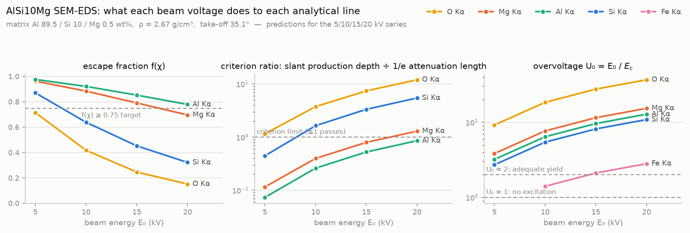

# EDS parameter #2 — beam-voltage series on AlSi10Mg (5 / 10 / 15 / 20 kV)

First standards-based test of a CALIBER acquisition recommendation. The voltage-selection
criterion worked out in the [PR #11 thread](https://github.com/vertical-cloud-lab/caliber/pull/11#issuecomment-5481281979)
(section 4) recommends 5 kV for quantifying AlSi10Mg and rejects 10/15/20 kV. This plan
pins down what that recommendation predicts *before* the data exist, so the four sessions
can confirm or refute it: beam energy drives spatial resolution, line intensity,
absorption, background, peak crowding, and sampled homogeneity all at once, and each of
those effects is stated below as a measurable expectation.

## 1. The hypothesis under test

A beam energy E₀ is acceptable for a quantified line when the deepest X-ray production
depth, measured along the slanted escape path toward the detector
(depth × 1/sin 35.1° = depth × 1.74), stays within that line's 1/e attenuation length in
the alloy — equivalently, escape fraction f(χ) ≳ 0.75 for the worst quantified line.
Claim from PR #11: for AlSi10Mg this caps E₀ at about 7–7.5 kV, so among
{5, 10, 15, 20} kV only 5 kV should quantify all three metal lines cleanly, and O Kα is
unquantifiable at every one of the four voltages.

## 2. Part 1 — the math check (done in this PR)

[`scripts/eds_voltage_predictions.py`](../scripts/eds_voltage_predictions.py) recomputes
the criterion from scratch — xraydb (Elam) mass attenuation coefficients and edges,
Kanaya–Okayama production depths, Philibert f(χ) — writing
[`eds_voltage_predictions.csv`](../scripts/eds_voltage_predictions.csv) and the figure
below.

Headline values against the numbers quoted in PR #11 section 4:

| quantity | this script | PR #11 §4 |
|---|---|---|
| Si Kα 1/e attenuation length | 1.32 µm | 1.32 µm |
| Si Kα slant production depth, 5/10/15/20 kV | 0.59 / 2.17 / 4.41 / 7.21 µm | 0.59 / 2.2 / 4.4 / 7.3 µm |
| Si Kα f(χ), 5/10/15/20 kV | 0.87 / 0.64 / 0.45 / 0.32 | 0.87 / 0.64 / 0.45 / 0.32 |
| O Kα voltage cap | 4.6 kV | 4.6 kV |
| alloy cap (binding line = Si Kα) | 7.6 kV | "about 7 kV" boundary at 7–7.5 |

The recomputation reproduces the recommendation exactly, so the 5 kV advice follows from
the stated criterion — the math "worked right." Whether the *criterion* is right is an
experimental question; that is Part 2.

Per-line caps sharpen what the series actually probes. Each line carries its own limit —
O Kα 4.6 kV, Si Kα 7.6 kV, Mg Kα 17.1 kV, Al Kα 21.9 kV — so the four voltages are a
graded stress test rather than one good setting and three bad ones: at 5 kV every metal
line passes; at 10 kV only Si Kα fails (ratio 1.6); at 15 kV Si fails at 3.3× the limit
and Mg turns marginal (0.80); at 20 kV Si is at 5.5× and Mg fails too (1.30). Al Kα
passes everywhere. If quantification error grows in that same graded order, the criterion
is capturing the physics that matters.

## 3. Part 2 — falsifiable predictions

All wt% below refer to standards-based, un-normalized analysis (section 6); the vendor's
normalized standardless output cannot adjudicate these because normalization entangles
every element's error with every other's.

| # | prediction | pass looks like | failure would mean |
|---|---|---|---|
| P1 | **kV-invariance is the core test.** The sample's true composition doesn't change with kV, so any drift in standards-based Si/Mg wt% across 5→20 kV is systematic error. The ±20% MAC-uncertainty band on the Si absorption correction widens from ±2% relative (5 kV) to ±8% (10), ±12% (15), ±16% (20). | Si and Mg agree across voltages within counting statistics at 5 kV, with scatter growing roughly in the banded order at higher kV | flat everywhere → criterion too conservative (H2); drift at *low* kV → surface effects dominate (H3) |
| P2 | **Fe Kα is physically absent at 5 kV** (U₀ = 0.70 < 1 — cannot be excited), marginal at 10 kV (U₀ = 1.41), usable at 15/20 kV (2.11 / 2.81). Spec allows Fe ≤ 0.55 wt%. | no Fe Kα peak at 6.40 keV at 5 kV; peak emerges by 15 kV if Fe ≳ 0.1–0.2 wt% | an apparent Fe Kα peak at 5 kV is an artifact (sum peak / misidentification), full stop |
| P3 | **Apparent C and O fall steeply with kV.** Production depth grows 0.34 → 4.1 µm (12×) from 5→20 kV, so a fixed surface film (native oxide, contamination, any embedded polishing silica) is diluted ~10×: O from ~1.7 wt% at 5 kV to ≲ 0.3 at 20 kV, C from ~2.0 to ≲ 0.4. | monotonic decrease near those magnitudes | O *rising* with kV at controlled dead time reproduces the July 15 kV anomaly and refutes its pile-up explanation |
| P4 | **Phase contrast collapses with kV.** At 5 kV (R_KO = 0.42 µm ≈ LPBF cell scale) the map splits into Si-rich vs Al-rich phase spectra (July session: 17.3 vs 7.5 wt% Si); at 15/20 kV (R_KO = 2.6 / 4.2 µm) both phases converge toward the bulk value | phase-spectrum Si separation shrinks monotonically with kV | persistence of full contrast at 20 kV would mean the microstructure is coarser than assumed |
| P5 | **Dead time climbs with kV at fixed current** (more ionization, harder continuum), so each voltage needs its own probe current to hold the 20–40% band | recorded current for ~25–30% DT decreases as kV rises | — (bookkeeping prediction that also guards P3/P7 against pile-up) |
| P6 | **Duane–Hunt endpoint equals the set kV** at every voltage | continuum terminates at E₀ within calibration error | endpoint deficit ⇒ charging ⇒ that spectrum's quant is suspect |
| P7 | **Mg Kα / Al Kα net-intensity ratio falls ×0.86 from 5→15 kV** (generation + absorption physics, PR #11 §3). The July standardless pair measured ×1.52 under ~49% dead time. | pile-up-free ratio lands near ×0.86 | a repeat of ×1.5 at ≤30% DT means the July excess was never pile-up |

## 4. Acquisition protocol

Held fixed across all four sessions:

- Same sample, same mapped region (retract to the same stage position; use a fiducial
  scratch or feature), final surface state noted — if the last polish was colloidal
  silica, record that: embedded SiO₂ reads as Si+O precisely at the 5 kV sampling depth.
- Analytical working distance the detector was calibrated at (take-off 35.1°).
- Amp/process time — the same setting every run, so energy resolution is comparable.
- Live time per map ≥ 300 s (the July 327.7 s map gave ~4400 net Mg Kα counts; target
  ≥ 10⁴ for ~1% counting precision on Mg).

Varied per session: E₀ = 5, 10, 15, 20 kV, and probe current, adjusted at each kV to hold
dead time at 25–30% (prediction P5 records the required current).

Standards block at **each** voltage, same session as the unknown (~15 min per voltage,
per PR #11 §6): Al chip, Si wafer, MgO — about 5 × 60 s live each. DTSA-II binds a
standard to detector + beam energy, so no bundle can be reused across voltages.

Recorded per spectrum: kV, probe current, dead time %, live/real time, working distance,
process time, total counts, Duane–Hunt endpoint. Exports: `.msa` (sum spectrum and each
standard) plus the vendor CSV, committed under
`outputs/voltage-series/<E0>kV/` (e.g. `outputs/voltage-series/05kV/`).

## 5. Decision rules — what each outcome does to CALIBER

- **H1 — criterion validated.** 5 kV gives the most accurate (vs. powder certificate)
  and most stable metal-basis quant; error grows in the graded P1 order. CALIBER encodes
  the rule as-is: f(χ) ≥ 0.75 for the worst quantified line.
- **H2 — criterion too conservative.** Standards-based results are kV-invariant within
  statistics even at f(χ) = 0.32: the φ(ρz) correction absorbs the physics, and the
  criterion can relax its floor (and higher kV wins on count rate, Fe access, and surface
  robustness).
- **H3 — criterion weights the wrong axis.** 5 kV is the *least* accurate because
  surface films (oxide, contamination, polishing residue) bias the shallow sampling
  volume more than absorption uncertainty biases the deep one. The criterion gains a
  surface-film weighting term that pushes against low kV.

Any of the three is a useful result — this series is the first entry in the
uncertainty-aware feedback loop the README describes, and the update rule is written
down before the data arrive.

## 6. Analysis

1. Fit each sum spectrum with the recipe from PR #11's
   `scripts/eds_kfactor_quant.py` (variance floor, bounded areas, Currie 3σ check) for
   net intensities and the P2/P6/P7 checks.
2. Standards-based wt% per voltage in DTSA-II (k-ratios against the same-session
   standards, φ(ρz) correction), reporting the **un-normalized analytical total**
   (98–102% is the health check) plus a metals-basis table.
3. Plot Si, Mg, Al wt% vs kV with counting-statistics error bars over the P1 prediction
   bands; tabulate P2–P7 verdicts; file the outcome under section 5.
